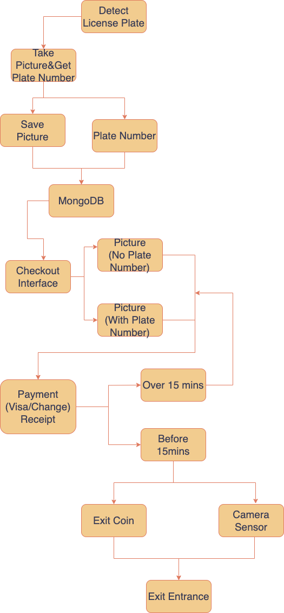

# License-plate-recognition
## Overview
This project uses a model trained with rear license plates from Ontario, Canada, and ultimately achieves object detection in an `Android` interface. The goal of the project is to utilize object detection technology to create a commercial model for automating parking lot entry/exit and checkout processes. This project employs `Python`, `Kotlin`, `Node.js`, and `MongoDB`.

- License Plate Detection
<div align="center">
    
</div>

- Search and Checkout Interface
<div align="center">
    
</div>

## Workflow
<div align="center">
    
</div>

## Get Started
The `YOLO` model was trained with `Python` for object detection, and the trained model is loaded onto an `Android` interface to detect license plates and license plate numbers. The detected license plate images and numbers are processed via `Node.js` and added to `MongoDB`.
1. Data Collection and Preprocessing: 
    - Data was collected using a Canon R6 and an iPhone XR (all photos taken in landscape orientation). The images were adjusted to 640x640 pixels using `Lightroom`, and quality was reduced to accelerate model training.

2. Data Labeling([CVAT](https://github.com/cvat-ai/cvat), [Label Studio](https://github.com/HumanSignal/labelImg)....): 
    - Export to YOLO format
3. Model Training uses Python ([YOLOv11](https://github.com/ultralytics/ultralytics))
4. MongoDB Create & Setting
5. Backend Setting (`.env`)
    ```
    DB_USER=AAAA
    DB_PASSWORD=BBBB
    DB_NAME=CCCC
    DB_USE=ProjectName
    DB_DEFAULT_PORT=3005
    ```
6. Android Setting
- `gradle.properties`
    ```
    Backend_URL=Backend_URL = http://YourIPAddress:Port/api/
    ```
    
- `Constants`
    ```
    const val MODEL_PATH = "carDetectModel/YourYoloModel.tflite"
    const val LABELS_PATH = "carDetectModel/custom_label.txt"
    ```
    

## API Endpoints
Check more API detail at `./API_DOCS`


