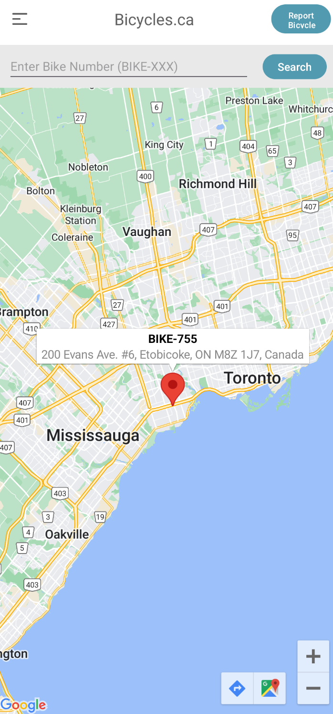

# Bicycles Return App

## Overview
[Quick Demo](https://youtube.com/shorts/I3jv35hmDLw)
This Android application is a simple bicycle return demo built with `Kotlin` and `Firebase`. The app allows users to add, view, return.

    

    

    

---

## Setup Instructions
1. Open the project in Android Studio.
2. Sync the Gradle files to install dependencies.
3. Build and run the app on an emulator or a physical Android device.
4. Enjoy!

